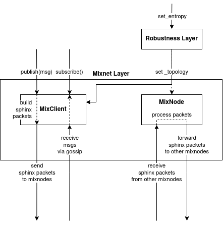

# Mixnet Specification

This is the executable specification of Mixnet, which can be used as a networking layer for the Nomos network.

## Public Components

- [`mixnet.py`](mixnet.py): A public interface of the Mixnet layer, which can be used by upper layers
- [`robustness.py`](robustness.py): A public interface of the Robustness layer, which can be on top of the Mixnet layer and used by upper layers

## Private Components

There are two primary components in the Mixnet layer.

- [`client.py`](client.py): A mix client interface, which splits a message into Sphinx packets, send packets to mix nodes, and receive messages via gossip. Also, this emits cover packets periodically.
- [`node.py`](node.py): A mix node interface, which receives Sphinx packets from other mix nodes, process packets, and forward packets to other mix nodes. This works only when selected by the topology construction.

Each components receives a new topology from the Robustness layer.

There is no interaction between mix client and mix node components.
