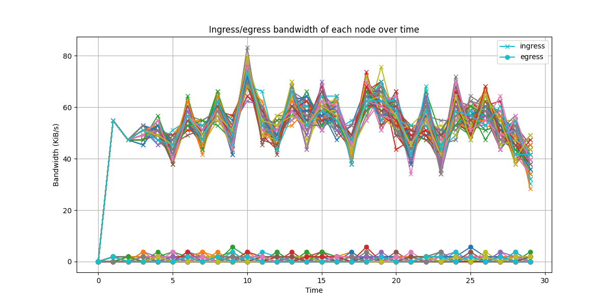
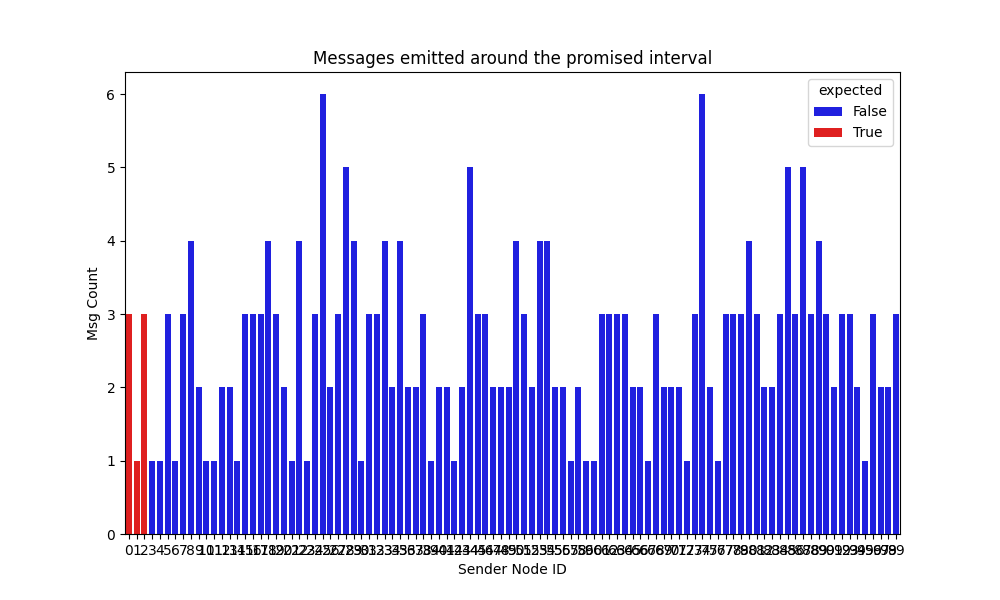
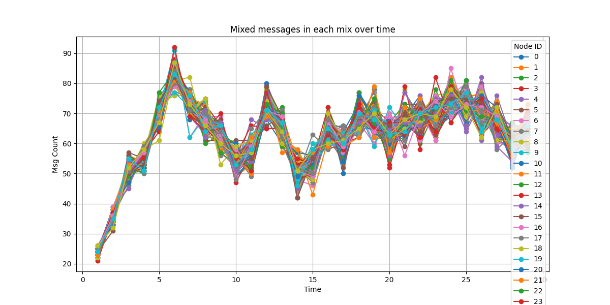

# Mixnet v2 Simulation

* [How to Run](#how-to-run)
  + [Time in simulation](#time-in-simulation)
* [Mixnet Functionalities](#mixnet-functionalities)
* [Adversary Models](#adversary-models)

## How to Run

First, make sure that all dependencies specified in the `requirements.txt` in the project root.
Then, configure parameters in the [`config.yaml`](./config.yaml), and run the following command:
```bash
python main.py --config ./config.yaml
```
The simulation runs during a specified duration, prints the results to the console, and show some plots.

### Time in simulation

The simulation is implemented based on [SimPy](https://simpy.readthedocs.io/en/latest/) which is discrete-event simulation framework.
All events are processed sequentially by a single thread.
However, multiple parallel events, which should be processed at the same time, can be also simulated by scheduling them at the same "time".

The simulation has the virtual time concept, which doesn't have the same scale as the real time.
If the event A is scheduled to happen at time 10, and the event B is scheduled to happen at time 11,
the simulation guarantees that the event B happens only after the event A happens.
But, it doesn't mean that the event B happens exactly 1 second after the event A. It will be much shorter.

If two events are scheduled at the same time (e.g. 10), the simulation processes the one that is scheduled first and the other one next (FIFO).
But, it is guarantees that those two event are processed before the events scheduled at time 11+.

Using this virtual time, complex distributed systems can be simulated in a simple way without worrying about the real-time synchronization.
For more details, please see the [Time and Scheduling](https://simpy.readthedocs.io/en/latest/topical_guides/time_and_scheduling.html#what-is-time) section in the SimPy documentation.

## Mixnet Functionalities
- Modified Sphinx
    - [x] Without encryption
    - [ ] With encryption
- P2P Broadcasting
  - [x] Naive 1-to-all
  - [ ] More realistic broadcasting (e.g. gossipsub)
- [x] Sending a real message to the mixnet at the promised interval
  - Each node has its own probability of sending a real message at each interval.
- [x] Cover traffic
  - All nodes have the same probability of sending a cover message at each interval.
- [x] Forwarding messages through mixes, and then broadcasting messages to all nodes if the message is real.
- Mix delays
  - [x] Naive random delays
  - [ ] More sophisticated delays (e.g. Poisson) if necessary

## Performance Measurements

- [ ] Bandwidth Usage
  - DRAFT with the naive 1-to-all broadcasting
    
  - Should be measured with realistic parameters and P2P gossiping.

## [Adversary Models](https://www.notion.so/Mixnet-v2-Proof-of-Concept-102d0563e75345a3a6f1c11791fbd746?pvs=4#c5ffa49486ce47ed81d25028bc0d9d40)
- [x] Inspecting message sizes to analyze how far each message has traveled since emitted by the original sender.
  - Currently, all messages have the same size (including messages broadcasted after being fully unwrapped). Thus, the adversary can learn nothing.
    ```
           message_size
    count        1806.0
    mean         1937.0
    std             0.0
    min          1937.0
    25%          1937.0
    50%          1937.0
    75%          1937.0
    max          1937.0
    ```
- Identifying nodes emitting messages around the promised interval.
  - [x] As the GPA
  - [ ] With partial visibility
  - [ ] Quantifying how much the expected frequent senders are anonymized by cover traffic
  
- [ ] Correlating senders-receivers based on timing
  - DRAFT
    
    - This can indicate whether a certain node has extremely few messages being mixed in the node.
      But, I don't think this is the best way to analyze the correlation.
      I think we need to try to simulate the actual timing attack.
- [ ] Active attacks